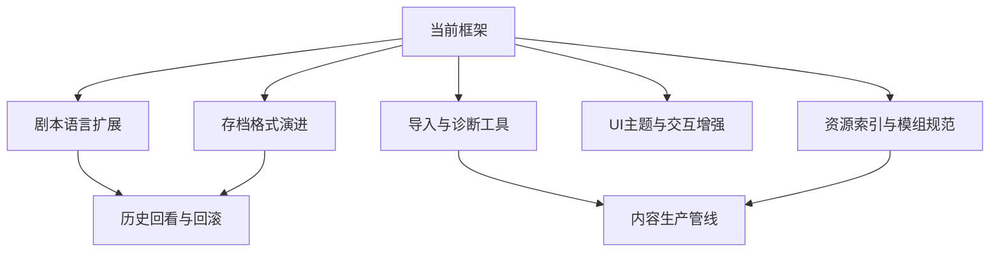

# 未来开发设计

本文面向后续功能扩展，基于当前 Godot 实现提出开发路线。设计目标是延续现有 Autoload、SceneManager、StoryManager、ResourceManager 和 Godot 原生资源体系，不推翻当前运行框架。

## 设计原则

后续开发建议遵循以下原则：

- 保持剧本数据驱动：剧情表现尽量来自 GalS 指令和资源，而不是散落在 UI 脚本中的临时代码。
- 保持 Godot 原生：优先使用场景、Resource、Signal、Tween、AudioServer、Theme 和 Editor 工具。
- 保持运行时可重放：会影响存档恢复的状态，优先设计成可由剧本重放恢复。
- 保持 Autoload 边界清晰：配置、资源、场景、剧情、存档、消息、音频各自负责明确领域。
- 保持文档同步：新增指令或存档字段时，同时更新指令表和存档格式说明。

## 总体路线



## 阶段一：完善文档和规格

第一阶段不需要大规模改代码，重点是让项目规则稳定下来。

建议产物：

- GalS 当前语法文档。
- 指令能力对照表。
- 资源索引规范。
- 存档字段说明。
- 场景命名和挂载约定。
- UI 暂停语义约定。

指令能力对照表建议包含：

| 字段 | 说明 |
| --- | --- |
| 文本语法 | 例如 `music play`、`bg set` |
| Head | 对应 `Instruction.Head` |
| 参数 | 参数名、类型、默认值 |
| 运行时处理 | 已实现、预留、计划中 |
| 可用位置 | 前序、后序、普通指令 |
| 示例 | 最短可运行用法 |

这样后续无论是写剧本、改导入器还是扩展运行时，都能先对齐同一份规格。

## 阶段二：GalS 指令系统扩展

### 已实现基础

当前已经具备：

- 行式文本解析。
- `<` 前序指令和 `>` 后序指令。
- CLI 风格参数解析。
- 音频、背景、角色动画、选项、条件、跳转等核心指令。
- `Instruction.Head` 参数类型转换。
- `StoryManager._instruction_handlers` 分发运行时处理。

### 建议完善变量指令

`Instruction.Head` 和 `DialogueImporter` 已包含变量指令：

- `var set`
- `var add`
- `var sub`
- `var mul`
- `var div`
- `var random`

未来可以把这些指令接入 `StoryManager._instruction_handlers`，统一操作 `Global.vars`。建议语义：

```text
< var set affection 3
< var add affection 1
< var random luck 0 100
```

变量系统建议约定：

- 所有剧本变量默认为浮点数。
- 未定义变量读取时默认值为 `0.0`。
- 随机数是否需要保存随机种子，取决于后续是否要求读档后完全复现。

### 建议接入场景原子指令

`Instruction.Head` 已预留：

- `SCENE_MOUNT`
- `SCENE_UNMOUNT`
- `TRANSITION_IN`
- `TRANSITION_OUT`

未来可以让剧本直接控制某些特殊 UI 或世界场景。例如：

```text
< scene mount ui 特殊演出UI res://Scenes/Special/special_ui.tscn
< trans out 0.5 fade_out true
< scene unmount ui 特殊演出UI 0 fade true
```

设计建议：

- 默认仍通过 `SceneManager` 执行，避免新增平行场景系统。
- 对可被剧本挂载的场景建立白名单或命名规范。
- 对常驻 UI 和临时 UI 区分 `free` 策略。
- 转场指令复用 `SceneManager.transition()`。

### 建议强化条件分支

当前 `if`、`elif`、`else`、`endif` 已具备基础运行能力。未来可以考虑：

- 支持字符串变量。
- 支持布尔变量。
- 支持逻辑运算：`and`、`or`、`not`。
- 支持变量与变量比较。
- 导入阶段检查条件结构配对。

建议先保持当前数值比较模型稳定，再按实际剧本需求增加表达式能力。

## 阶段三：导入器和开发工具链

### 导入诊断报告

建议 `DialogueImporter` 在导入后生成报告，内容包括：

- 导入文件数量。
- 每个文件的对话数、指令数、注释数。
- 未知指令。
- 参数缺失或类型转换提示。
- option / endif 等结构检查结果。
- 引用资源是否存在。

报告可以先输出到日志，后续再生成 JSON 或 Markdown。

### 剧本检查命令

未来可以做一个独立检查入口，用于不启动完整游戏也能检查剧本：

- 扫描 `scripts/`。
- 解析 GalS。
- 检查指令和资源引用。
- 输出诊断报告。

如果后续制作外部工具，也可以复用同一套指令规格。

### 编辑器辅助

可以考虑 Godot EditorPlugin 或外部脚本：

- 一键重新导入剧本。
- 查看指令列表。
- 预览当前脚本的对话数量和分支结构。
- 检查未使用资源。
- 生成资源索引。

这些工具应服务内容生产，不必进入运行时主逻辑。

## 阶段四：存档系统演进

### 当前基础

当前 `SavedGame` 保存：

- `vars`
- `script_name`
- `idx`
- `execution_stack`
- `timestamp`
- `title`
- `thumbnail_path`

载入后通过 `StoryManager` 重放到 `idx`，恢复画面和音频状态。

### 增加版本字段

建议未来加入：

```gdscript
@export var version: int = 1
```

然后定义兼容策略：

- 版本缺失时按 `1` 处理。
- 新字段缺失时使用默认值。
- 重大结构变化时增加迁移函数。

### 扩展预览信息

可增加：

- `chapter_title`
- `scene_title`
- `preview_text`
- `play_time`
- `created_at_unix`

这样 SaveUI 可以展示更友好的存档信息。

### 历史与回滚准备

如果未来支持历史回看，建议保存独立的对话日志结构：

```text
DialogueLogEntry
  script_name
  idx
  character
  text
  timestamp
```

如果未来支持回滚，则需要更完整的状态点：

- 变量快照。
- 背景资源键。
- 角色纹理、位置、透明度。
- 当前音乐资源键和播放位置。
- 条件执行栈。

建议先实现历史回看，再评估回滚。回滚比历史回看复杂得多，会影响存档、音频、角色动画和剧情重放策略。

## 阶段五：UI 与交互增强

### UI 主题化

当前 UI 已能运行并覆盖主要流程。未来可以逐步把样式沉淀为 Godot Theme：

- 通用按钮样式。
- 选项按钮样式。
- 存档列表样式。
- 设置滑块样式。
- Toast 类型样式。
- 对话框字体、边距、颜色。

这样视觉调整可以更多通过资源完成，而不是写在脚本中。

### 历史回看 UI

建议新增 `HistoryUI`：

- 从 `StoryManager` 或独立 `HistoryManager` 读取对话日志。
- 打开时暂停剧情。
- 关闭后恢复暂停前状态。
- 可复用 `SceneManager.mount({"ui": ...})` 的模式。

### 快捷键和输入映射

可以整理 Godot InputMap：

- 推进对话。
- 快进。
- 自动模式。
- 跳过模式。
- 打开菜单。
- 打开历史。
- 快速保存。
- 快速读档。

建议把输入动作写进文档，避免 UI 按钮和键盘快捷键语义不一致。

### 设置项扩展

未来可加入：

- 全屏/窗口模式。
- 文本速度预设。
- 自动播放等待策略。
- 已读跳过和全部跳过区分。
- 字体大小。
- 语言选择。

设置项应统一进入 `Global.config`，并由 `Global.save_config()` 管理保存。

## 阶段六：资源和模组规范

### 资源命名

建议建立资源键命名规则：

- BGM：`bgm_章节_场景_用途`
- SFX：`sfx_动作_变体`
- Voice：`voice_角色_编号`
- 背景：`bg_地点_时间`
- 立绘：`char_角色_表情_服装`

当前代码支持中文和带空格文件名，Godot 也能正常处理；命名规范的目的不是限制可用性，而是方便长期维护和模组协作。

### 模组元数据

当前模组目录按 `mod.json` 读取：

- `name`
- `pck_file`
- `priority`

未来可以扩展：

- `version`
- `author`
- `description`
- `dependencies`
- `conflicts`
- `enabled`

加载顺序仍可沿用 `priority`。

### 资源索引生成

后续可以做一个索引生成工具：

- 扫描 `Resources/audio` 和 `Resources/image`。
- 生成或更新 `index.json`。
- 检查重复键。
- 检查不存在的文件引用。

对于剧本中直接写文件名的情况，也可以生成建议映射。

## 阶段七：音频系统扩展

当前音频系统已经按 Music、SFX、Voice 分层。未来可以考虑：

- BGM 记忆当前播放位置，用于回滚或读档增强。
- SFX 分类音量，例如 UI SFX 与环境 SFX。
- 语音自动等待策略：语音未播完时是否允许自动推进。
- 角色语音与角色名关联。
- 音频淡入淡出参数暴露给 GalS。

这些能力应继续通过 `AudioManager` 对外暴露，避免剧本或 UI 直接操作具体播放器。

## 阶段八：剧情结构设计

### 章节和场景元数据

未来可以为每个剧本资源补充元数据：

- 章节名。
- 场景名。
- 作者或版本。
- 默认背景。
- 推荐 BGM。
- 可达分支列表。

元数据可以来自单独 JSON，也可以由导入器从文本头部注释提取。

### 叙事图

当前 `jump` 和 `begin script` 已支持脚本间跳转。后续如果分支复杂，可以构建叙事图：

- 节点：剧本文件或章节片段。
- 边：`jump`、选项、条件跳转。
- 标记不可达节点。
- 生成流程图或调试报告。

这更适合放在工具链中，不必影响运行时执行方式。

## 阶段九：测试和验收设计

建议维护一组专用验收剧本：

```text
scripts/test/basic_dialogue.txt
scripts/test/audio.txt
scripts/test/character_animation.txt
scripts/test/options.txt
scripts/test/conditions.txt
scripts/test/save_load.txt
```

每个验收剧本只覆盖一类能力。升级引擎时，可以从主菜单或测试入口逐项验证。

验收项示例：

- 对话能正常打字和跳过。
- BBCode 标签不会被打字机破坏。
- BGM 淡入淡出正常。
- 语音事件能在指定时间触发指令。
- 选项选择后不会执行兄弟分支。
- 条件分支能按变量跳转。
- 存档载入后画面和变量恢复到预期状态。

## 推荐里程碑

### M1：规格同步

- 更新 GalS 语法文档。
- 建立指令能力对照表。
- 明确资源解析优先级。
- 记录存档字段说明。

### M2：运行时补齐

- 接入变量指令运行时处理。
- 完善导入器结构检查。
- 补充资源引用检查。
- 增加存档版本字段。

### M3：内容生产体验

- 一键导入/检查剧本。
- 自动生成资源索引。
- 输出导入报告。
- 建立验收剧本。

### M4：用户体验增强

- 历史回看。
- 快捷键规范。
- UI 主题化。
- 设置项扩展。

### M5：高级叙事能力

- 叙事图分析。
- 剧本元数据。
- 可选回滚。
- 更完善的模组依赖与冲突处理。

## 风险控制

后续开发时建议特别关注：

- 不要让 UI 绕过 `StoryManager` 直接改变剧情索引。
- 不要让剧本绕过 `ResourceManager` 直接持有难以追踪的资源路径。
- 不要在存档中保存大量可由重放推导的临时状态。
- 不要在未形成需求前过早引入复杂表达式语言。
- 不要让模组覆盖规则只存在于代码里，必须文档化。

## 总结

项目的未来开发可以沿着当前实现自然延伸：先稳定规格，再补齐运行时指令，再加强内容生产工具，最后扩展历史、回滚、模组和叙事图等高级能力。当前框架已经提供了足够好的基础，后续重点应是让规则更明确、工具更顺手、存档和资源体系更适合长期内容生产。
