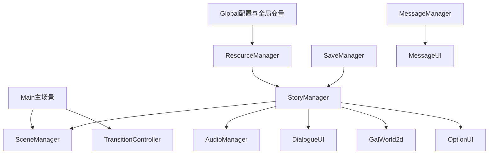

# 架构及其优化方案

本文描述当前项目的实际架构，并给出后续可演进的优化方向。这里的“优化”不表示当前实现存在明显问题，而是面向项目规模扩大、剧本文本增多、资源类型扩展、工具链完善时的维护性和扩展性建议。

## 当前架构概览

项目采用“Godot 场景表现 + Autoload 服务层 + 剧本资源驱动”的结构：

这套架构的核心特征是：

- `Main` 不承担剧情逻辑，只负责把 Godot 编辑器中的层级节点交给全局管理器。
- Autoload 提供跨场景服务，适合 Galgame 这种需要长期存在的全局状态和系统。
- `SceneManager` 管理场景实例的池化、挂载、卸载和转场。
- `StoryManager` 作为剧本 VM，统一解释 `GalEventItemSequence`。
- UI、世界层、音频、存档和消息都通过清晰入口协作。

## 架构分层

### 配置与状态层

主要模块：

- `Autoloads/global.gd`
- `config.json`
- `index.json`

职责：

- 合并默认配置与外部配置。
- 保存全局变量 `vars`。
- 维护场景名称到路径的映射。
- 应用音量、文字速度、自动播放等待时间等运行设置。
- 退出时写回配置。

这一层是其他模块的配置来源，不直接参与具体 UI 显示。

### 资源与导入层

主要模块：

- `Autoloads/resource_manager.gd`
- `Autoloads/dialogue_importer.gd`
- `Scenes/GalEventItem/*.gd`
- `scripts/`
- `GalSs/`
- `Resources/`

职责：

- 将文本剧本导入为 Godot Resource。
- 维护音频、图片、剧本资源的键名映射。
- 支持 PCK 模组加载。
- 提供缓存和统一加载入口。

这一层把“策划文本和素材路径”转换成运行时可消费的 Godot 资源。

### 场景与表现层

主要模块：

- `Autoloads/scene_manager.gd`
- `Scenes/Main/main.gd`
- `Scenes/GalWorld2d/`
- `Scenes/DialogueUI/`
- `Scenes/GalUI/`
- `Scenes/OptionUI/`
- `Scenes/SaveUI/`
- `Scenes/SettingUI/`
- `Scenes/MessageUI/`
- `Scenes/TransitionController/`

职责：

- 把 UI 和 2D 世界挂到合适 CanvasLayer。
- 管理常驻场景、临时 UI 和转场。
- 接受剧情运行时发来的表现指令。
- 通过 Godot 信号把玩家输入反馈给运行时。

这一层充分依赖 Godot 的节点树、CanvasLayer、Control 输入、Tween 和信号机制。

### 剧情运行层

主要模块：

- `Autoloads/story_manager.gd`
- `Scenes/GalEventItem/dialogue.gd`
- `Scenes/GalEventItem/instruction.gd`
- `Scenes/GalEventItem/prev_instruction.gd`
- `Scenes/GalEventItem/post_instruction.gd`
- `Scenes/GalEventItem/gal_event_item_sequence.gd`

职责：

- 解释 `GalEventItemSequence.seq`。
- 维护脚本索引、执行模式、选项状态和条件栈。
- 执行音乐、语音、背景、角色、选项、跳转和条件指令。
- 调用 UI、世界层、音频和场景服务。

这是项目的核心编排层。

### 存档与恢复层

主要模块：

- `Autoloads/save_manager.gd`
- `Autoloads/saved_game.gd`
- `Scenes/SaveUI/save_ui.gd`

职责：

- 扫描、展示、保存、删除 `.tres` 存档。
- 生成并加载缩略图。
- 保存脚本名、执行索引、变量和条件执行栈。
- 载入后由 `StoryManager` 重放到存档点。

这种设计适合脚本驱动画面的 Galgame：状态不是分散保存每个节点属性，而是通过剧本指令重建。

## 当前架构优势

### Godot 原生能力使用充分

项目没有绕开 Godot 的场景树和资源系统，而是直接使用：

- Autoload 管理全局服务。
- `PackedScene.instantiate()` 创建可复用 UI。
- `Resource` 保存剧本和存档。
- `CanvasLayer` 控制显示层级。
- `Tween` 实现对话、立绘和音乐过渡。
- `Signal` 与 `await` 管理异步流程。
- `AudioServer` 和 Bus 管理音量。

这让实现方式与 Godot 编辑器和运行时模型保持一致。

### 剧本和表现解耦

GalS 文本不直接操作节点，而是先导入为 `Instruction` 和 `DialogueItem`。运行时再把指令映射到背景、立绘、音频、选项和跳转。这样后续可以继续扩展指令，而不需要改变剧本文本的基本组织方式。

### 场景复用成本低

`SceneManager` 的池化设计适合视觉小说常见场景：

- 对话 UI 长期反复使用。
- GalUI 长期存在于游戏内。
- 选项 UI 多次显示但每次内容不同。
- Gal2D 在多个剧本间复用。

卸载但不释放可以保留节点状态和信号连接，减少重复实例化。

### 存档恢复思路符合脚本驱动

保存 `idx` 和运行时变量，再通过 SKIP 重放到存档位置，能够让此前的背景、音乐、立绘和变量指令重新生效。这比单独保存大量节点快照更贴合当前“剧本就是状态来源”的架构。

## 架构边界

当前架构适合中小型 Galgame 或持续演进中的 Galgame 引擎原型。随着项目扩大，主要压力会出现在：

- 剧本语言功能增多后，导入器、`Instruction.Head` 和 `StoryManager._instruction_handlers` 的同步维护。
- 大量资源和模组叠加后，资源索引、缓存策略和覆盖规则需要更明确。
- 存档格式随运行时状态扩展后，需要版本迁移策略。
- UI 主题和交互细节增多后，运行时动态创建控件的样式维护成本上升。
- 历史回看、回滚等功能加入后，需要保存更细的剧情日志和表现状态。

这些不是当前框架不能运行的问题，而是项目规模扩大后自然会出现的工程管理点。

## 优化方向一：文档化生命周期

建议把 Autoload 初始化和主场景注入挂载点的时序写成固定说明，并在贡献文档中强调：

1. Autoload `_ready()` 会先于主场景 `_ready()`。
2. `StoryManager` 和 `SaveManager` 可在 Autoload 阶段预加载场景到 `SceneManager.pool`。
3. `Main._ready()` 会把最终显示层节点赋给 `SceneManager.scene_managers[*].mount_point`。
4. 之后的 `SceneManager.mount()` 才会把节点挂到真实显示层。

这样可以避免后续开发者误以为“预加载时没有显示”是异常行为。

## 优化方向二：指令能力对照表

当前指令能力分布在三个地方：

- `DialogueImporter.INSTRUCTION_MAP`
- `Instruction.Head`
- `StoryManager._instruction_handlers`

建议维护一张文档或表格，把每条指令标记为：

- 文本语法
- `Instruction.Head`
- 参数类型
- 是否已有运行时处理
- 是否允许前序/后序
- 示例

这可以帮助编剧、工具链和运行时开发保持一致。对于已在枚举中预留但主流程尚未使用的指令，可以标记为“预留”或“待接入运行时处理”。

示例：

| 文本指令 | Head | 运行时状态 | 说明 |
| --- | --- | --- | --- |
| `music play` | `MUSIC_PLAY` | 已处理 | 播放 BGM |
| `bg set` | `SET_BACKGROUND` | 已处理 | 设置背景纹理 |
| `option` | `OPTION` | 已处理 | 扫描选项组并显示选项 UI |
| `if` / `elif` / `else` / `endif` | 逻辑流 Head | 已处理 | 基于变量表判断分支 |
| `scene mount` | `SCENE_MOUNT` | 预留 | 可用于后续剧本直接控制场景 |
| `trans in` / `trans out` | 转场 Head | 预留 | 可用于后续剧本直接控制转场 |

## 优化方向三：资源索引规则明确化

当前 `ResourceManager` 已支持 `index.json`、默认目录推导、`res://` / `user://` 直通和 PCK 模组。建议在文档层明确资源解析优先级：

1. 直接路径：`res://` 或 `user://`
2. `index.json` 映射
3. 类型默认目录推导
4. 直接尝试作为路径

后续如果模组会覆盖资源，建议补充：

- PCK 加载顺序和优先级含义。
- 同名资源键的覆盖策略。
- 官方资源与模组资源的命名规范。
- 打包导出后资源和存档的路径差异。

## 优化方向四：缓存策略分层

当前 `StoryManager.next_story()` 会调用 `ResourceManager.clear_all_cache()`。这简单明确，适合当前规模。

后续资源量增大时，可以考虑按类型或场景分层：

- 剧本资源：切换剧本时可清理或保留。
- 背景/立绘纹理：根据章节预加载或最近使用缓存。
- 音频：BGM 可保留当前曲目，短音效可按需加载。
- UI 资源：通常可常驻。

建议先通过实际加载耗时和内存占用判断是否需要改动，不必提前复杂化。

## 优化方向五：存档格式版本化

随着功能扩展，`SavedGame` 可能需要记录更多信息，例如：

- 存档格式版本号。
- 当前选项组状态。
- 历史对话日志。
- 当前自动/跳过模式是否保存。
- 章节标题、场景名、预览文本。
- 已读文本或回想解锁状态。

建议在新增字段前先定义版本策略：

- 旧存档缺少字段时使用默认值。
- 新字段尽量可从剧本重放推导时，不必重复保存。
- 无法推导且影响恢复的字段才写入存档。

这样可以延长存档兼容周期。

## 优化方向六：UI 主题资源化

`OptionUI` 当前按代码动态创建 Button 和 `StyleBoxFlat`。这种方式直观、可运行，也适合快速验证样式。后续如果 UI 视觉规范稳定，可以考虑：

- 使用 Godot Theme 统一按钮、列表、滑块和面板样式。
- 提供选项按钮模板场景。
- 使用对象池复用选项按钮。
- 将不同消息类型的 Toast 样式资源化。

这样可以减少样式代码重复，让视觉调整更多发生在编辑器资源中。

## 优化方向七：剧情日志与回滚基础

如果后续要做历史回看或回滚，建议在 `StoryManager` 每次显示 `DialogueItem` 时记录一条结构化日志：

- 脚本名
- 指令索引
- 说话人
- 文本
- 当前变量快照或变量增量
- 当前背景/立绘/音乐摘要

历史回看只需要文本日志；回滚则需要更完整的状态恢复策略。可以先实现只读历史，再评估回滚对存档和重放机制的影响。

## 优化方向八：导入器诊断增强

当前 `DialogueImporter` 已经能识别未知指令并输出日志。后续可以增加导入报告：

- 每个剧本导入了多少对话和指令。
- 未知指令列表。
- 参数数量或类型提示。
- option / endif 等结构匹配检查。
- 资源键存在性检查。

这类能力更适合放在导入阶段或编辑器工具里，避免运行时才暴露脚本问题。

## 优化方向九：测试样例和验收剧本

建议建立少量专门用于验证引擎能力的 GalS 样例：

- 基础对话和 BBCode。
- 音乐、语音、音效。
- 背景和立绘动画。
- option 分支。
- if/elif/else/endif 嵌套。
- jump 和 begin script。
- 存档后载入恢复。

这些样例不一定要成为自动化测试，但可以作为每次大改后的手动验收路线。

## 推荐演进顺序

优先级可以按“低风险、高收益”排序：

1. 维护指令能力对照表和资源解析说明。
2. 补充导入器诊断输出。
3. 规范 UI 主题和常用控件模板。
4. 为 `SavedGame` 增加版本字段和兼容策略。
5. 扩展剧情日志，为历史回看铺路。
6. 按实际性能数据决定是否细分资源缓存。
7. 接入预留的场景/转场原子指令。

## 总结

当前架构已经具备稳定 Galgame 框架所需的核心部件：服务层、资源层、场景层、剧情运行层、存档层和音频层都已形成闭环。后续优化不需要推翻现有实现，更适合沿着 Godot 原生机制继续演进：把隐含约定写成文档，把预留能力逐步接入，把资源、存档和 UI 的规范沉淀为可复用工具。
