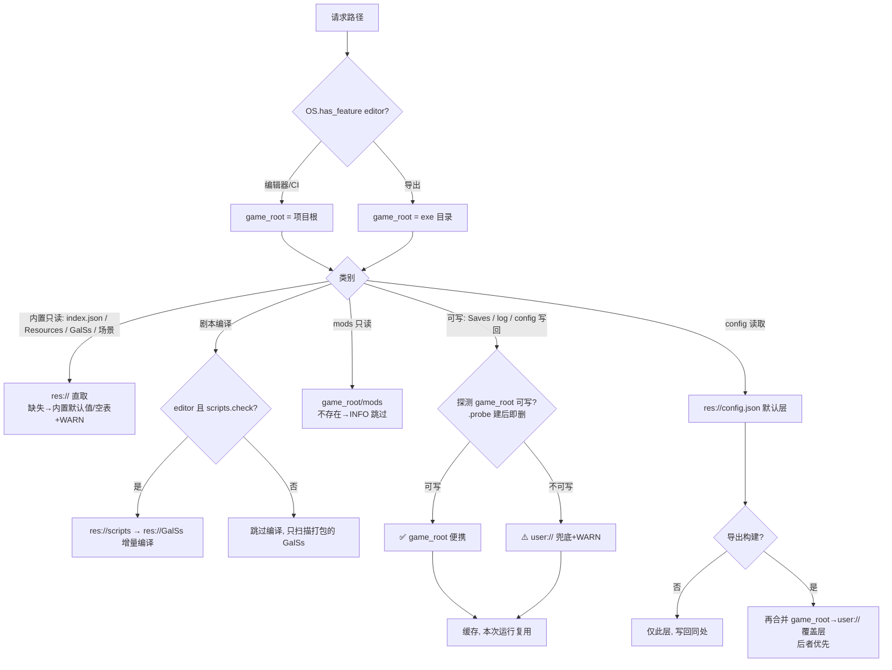

# 路径策略设计

引擎所有路径经 `PathManager`（`Autoloads/path_manager.gd`，静态类）单一入口解析，业务代码不得出现裸相对路径或临时 `OS.get_executable_path()`。

## 原则

- **三域**：内置 `res://`（只读资产）｜游戏根 `game_root`（编辑器=项目根，导出=exe 旁）｜用户域 `user://`（最终兜底）。
- 可写数据（存档/日志/配置写回）**便携优先**：探测 `game_root` 可写性，不可写降级 `user://` 并记 WARN；编辑器/CI 恒为项目根。
- config 分层：编辑器单层；导出 = `res://` 默认层 + `game_root`/`user://` 覆盖层依次合并（后者优先）。

## 流转图

## 覆盖表

| 路径 | 编辑器 | 导出 | 降级 |
|------|--------|------|------|
| config 读 | `res://config.json` | +`game_root`→`user://` 覆盖层 | 无覆盖层→默认层→代码默认值 |
| config 写回 | `res://config.json` | 便携优先 | `game_root`→`user://`→ERROR |
| index.json / Resources / GalSs / 场景 | `res://` 显式 | 同左（入 PCK） | 缺失→空表+WARN |
| mods/ | 项目根 `mods/` | exe 旁 `mods/` | 不存在→INFO 跳过 |
| Saves/ + 缩略图 | 项目根 `Saves/` | exe 旁优先 | →`user://` |
| log.txt | 项目根 | exe 旁优先 | →`user://`→仅控制台 |
| scripts 编译 | `res://scripts`→`res://GalSs`，config 注入生效 | 不编译 | — |
| GalSs 扫描 | 按文件名登记逻辑路径 | 包内物理文件为 `.tres.remap`，须 `trim_suffix(".remap")` 取逻辑路径 | 缺失→空表+WARN |
| 缩略图入档 | 存文件名，读时拼 `SAVE_DIR` | 同左 | 旧档绝对路径存在则用，否则回退拼接 |

> **注意（已实测，Godot 4.5.1）**：导出器会将 `.tres` 转换并留下 `.tres.remap` 重定向，此行为与 `binary_format/embed_pck`、`script_export_mode` 均无关，无法通过导出配置关闭。因此**凡「列目录取文件名」的代码都必须经 `Utils.logical_name()` 还原为逻辑名**（`DirAccess` 见物理名，`ResourceLoader` 走逻辑名）。本项目约定 `embed_pck=false`（exe+pck 分离，便于增量更新），但分离导出不能规避 `.remap`。
