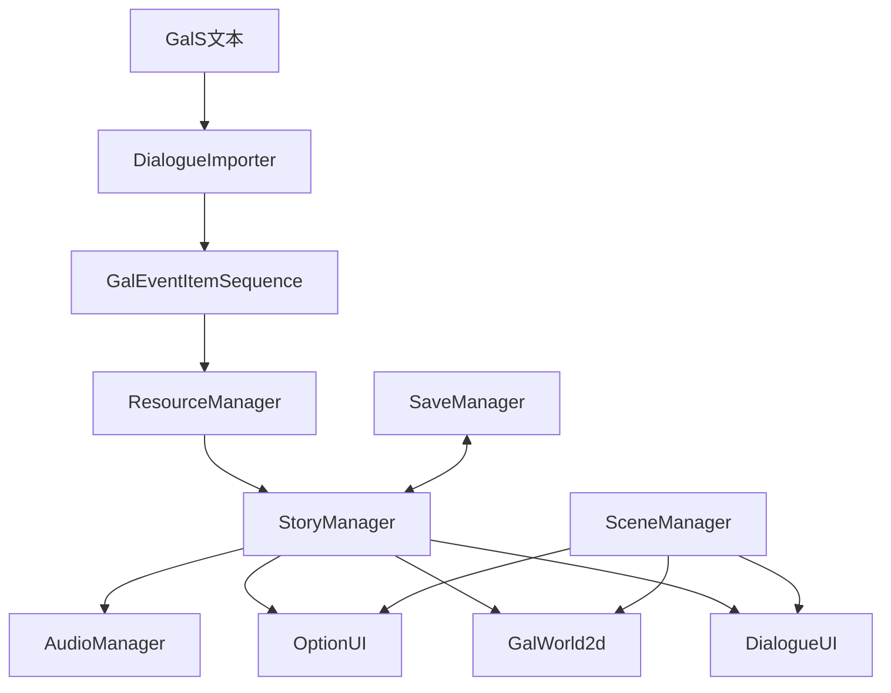

# 项目分析

本文基于当前仓库的实际实现，从 Godot 运行角度分析项目结构、启动流程、剧情流程、UI 交互、资源加载、存档读档和音频系统。

## 总体定位

当前项目是一个以 Godot 场景树为表现层、以 Autoload 为服务层、以 `GalEventItemSequence` 为剧本数据层的 Galgame 运行框架。它不是把所有逻辑集中在单一主场景里，而是将配置、资源、音频、场景、剧情、存档和消息拆成多个 Autoload，再由 `Main` 场景负责把实际的挂载层交给 `SceneManager`。

核心数据流如下：



从实现结果看，项目已经形成了清晰的运行闭环：

- 启动：Autoload 初始化，主场景装配挂载点，启动画面转主菜单。
- 剧情：主菜单启动 `StoryManager.next_story()`，挂载对话 UI、GalUI 和 Gal2D，加载并执行剧本。
- 表现：指令控制背景、立绘、音乐、语音、音效、选项和跳转。
- 存档：保存当前脚本名、执行索引和变量；载入后通过 SKIP 快速推进重放到存档点（条件执行栈等运行时簿记由重放自然重建，不入档）。
- 设置：使用 Godot 音频总线与全局对话参数实时生效，并在退出时保存配置。

## Godot 启动流程

`project.godot` 中的主场景是 `Scenes/Main/main.tscn`，Autoload 顺序为：

1. `Global`
2. `ResourceManager`
3. `AudioManager`
4. `SceneManager`
5. `StoryManager`
6. `SaveManager`
7. `MessageManager`

这个顺序对当前实现是有意义的：

- `Global` 先合并 `config.json`，提供配置和场景路径表。
- `ResourceManager` 依赖 `Global.config` 加载资源索引、模组和剧本资源。
- `AudioManager` 提供总线枚举和播放接口，供 `Global.apply_loaded_settings()` 与剧情指令使用。
- `SceneManager` 提供场景池和挂载 API。
- `StoryManager` 和 `SaveManager` 在 `_ready()` 中预加载自身需要的 UI 或世界场景。

需要从 Godot 生命周期理解的一点是：`StoryManager` 和 `SaveManager` 预加载出的节点可以先放在 `SceneManager` 的 `pool` 中，不必立即显示在最终 UI 层。真正的显示父节点由 `Scenes/Main/main.gd` 在主场景 `_ready()` 中注入：

```gdscript
SceneManager.scene_managers["world2d"]["mount_point"] = world2d
SceneManager.scene_managers["ui"]["mount_point"] = ui
SceneManager.transition_controller = transition_controller
```

这种写法符合 Godot 的运行模型：Autoload 可以先创建和持有节点实例，主场景准备好后再把挂载点切换到编辑器中实际布置的层级。

## 主场景层级

`Scenes/Main/main.tscn` 定义了四个主要层：

- `SceneLayer/World2D`：2D 世界挂载点，用于 `GalWorld2d`。
- `UILayer/UI`：普通 UI 挂载点，用于启动画面、主菜单、对话 UI、GalUI、存档和设置等。
- `TransitionLayer/TransitionController`：转场层，`process_mode = 3`，暂停时也能继续完成转场。
- `MessageLayer/MessageUI`：消息层，位于更高 CanvasLayer，用于 Toast。

这种层级让剧情画面、交互 UI、全屏遮罩和消息提示互不抢层。`SceneManager` 不直接假设具体 CanvasLayer，而是通过 `Main` 注入的 `mount_point` 挂载节点。

## 场景管理分析

`SceneManager` 的结构分为 `world2d` 和 `ui` 两类，每类都有：

- `pool`：已实例化但未挂到显示树的场景。
- `mounted`：已经挂到当前挂载点的场景。
- `mount_point`：挂载父节点。

主要操作包括：

- `pre_load()`：加载 PackedScene 并实例化，放入 `pool`。
- `mount()`：优先从 `pool` 取节点，没有缓存再现场加载。
- `unmount()`：从场景树移除节点，按 `free` 参数决定释放还是放回池。
- `mount_and_unmount()`：转场淡出、卸载、挂载、转场淡入。
- `umount_all()`：卸载指定类别的全部已挂载场景。

当前核心 UI 和世界场景大多采用“卸载但不释放”的方式复用，这对 Galgame 是合理的：对话 UI、GalUI、选项 UI、Gal2D 反复出现，保留实例可以减少重复加载和重复连接信号的成本。

## 剧情执行分析

`StoryManager` 是项目中最关键的运行时模块。它把剧本资源看作一个顺序事件数组，数组元素可能是：

- `DialogueItem`：对话或旁白。
- `PrevInstruction`：对话前执行的指令。
- `PostInstruction`：对话后执行的指令。
- 基类 `Instruction` 实例：独立指令（不绑定对话，执行流到达即执行）。

执行时有两组状态。

迭代状态 `IterateMode`：

- `DEFAULT`：正常执行各类指令和对话。
- `POST_COMMAND`：打字完成窗口，连续执行后序指令与独立指令，遇到前序指令或对话后回到默认流程。

管理状态 `ManagerMode`：

- `INTERACT`：玩家点击或按键推进。
- `AUTO`：对话完成后等待 `Global.auto_wait_time` 自动推进。
- `SKIP`：跳过打字和等待，快速推进。
- `STOP`：屏蔽外部推进输入。

实际推进过程为：

1. `next_story()` 重置当前状态（含角色现场），淡出，卸载旧 UI/世界，清资源缓存。
2. 挂载 `对话UI`、`GalUI` 和 `Gal2D`。
3. `load_script(next_script)` 从 `ResourceManager` 加载 `.tres` 剧本（校验编译器版本标记）。
4. `run_script()` 顺序执行开场指令（背景、音乐、初始立绘），显示第一句对话并等待交互。
5. 玩家输入由 `DialogueUI.forward` 或 `fast_forward` 信号回到 `StoryManager`。

执行模型为「同步主循环 + 信号/定时器驱动」：`run_script` 不挂起协程，执行到对白/选项/跳转/等待即返回，推进由 `dialogue_finished` 信号、一次性定时器与选项 UI 信号驱动。

## 对话和输入

`DialogueUI` 负责对话框淡入淡出、角色名、正文和头像。正文使用 `RichTextLabel`，支持 BBCode 内容。打字机效果由 Tween 逐步追加字符；遇到 BBCode 标签时会把标签整体加入，避免标签被逐字拆坏。

输入逻辑：

- 左键或 `ui_accept` 发出 `forward`。
- 右键发出 `fast_forward`。
- 如果正在打字，`StoryManager` 会优先调用 `skip_typing()`。
- 如果已经打完，则继续执行下一段剧本。

淡入期间 `mouse_filter` 为 `IGNORE`，淡入完成后变成 `PASS`，这是 Godot UI 中常见的输入控制方式，可以避免半透明入场阶段吞掉用户点击。

## 画面表现

`GalWorld2d` 是世界层，包含背景 `Sprite2D` 和多个 `Character` 节点。角色数量由 `Global.config["character"]["max"]` 决定，在 `_init()` 中实例化。

`Character` 使用归一化坐标管理立绘底部中心位置：

- `Vector2(0.5, 1.0)` 表示屏幕底部居中。
- 位置会根据可见视口大小换算为实际坐标。
- 视口大小变化时重新计算显示位置。

角色动画直挂实例（BGalS v2）：每条 `char <实例> <动作>` 指令向该实例的 `animation_list` 队列追加一步并自动播放——同实例步骤排队执行，跨实例连写天然并行；`wait:true` 可挂起剧情直到该实例动画完成。

## 选项和分支

选项由 `*` 选项行 + 缩进分支体组成（编译期拍平为 `OPTION`…`OPTION_END` 线性序列）。`StoryManager._option_begin()` 遇到选项时向后扫描到 `OPTION_END`，收集选项文本（带 `if:` 条件的选项求值过滤，全假则跳过整组）和分支起点，然后挂载 `OptionUI` 等待玩家选择。

玩家选择后：

- `OptionUI` 发出 `option_made(index)`。
- UI 自行卸载并回到 `SceneManager` 的池中。
- `StoryManager` 把 `idx` 改到对应分支入口继续执行。

如果执行某个分支时碰到兄弟 `option`，`StoryManager` 会跳到当前选项组的 `OPTION_END`，避免误入其他分支。载入存档或退出时若当前有选项 UI，相关代码会发出 `canceled` 以打断等待协程。

## 条件分支

当前实现已有 `if`、`elif`、`else` 的运行时处理（缩进块语法，编译期配对校验并拍平）。v2.3 起条件表达式为编译期递归下降解析（`and`/`or`/`not`/括号/裸变量真值，优先级 `not` > `and` > `or`），产物为后缀记号流（`Instruction.CondTag`），运行时由 `_eval_condition` 栈机求值——栈机是全函数，畸形输入按 false + 错误日志处理。

分支跳转目标（`next_target`/`end_target`）由编译器在解析收尾时回填进指令参数（`DialogueImporter._resolve_condition_targets`），运行时按参数直接跳转——不设运行时跳转表，也没有链式扫描与缺项兜底。运行时用 `_execution_stack` 记录每一层条件结构是否已有分支执行过；该栈不入档（读档重放时自然重建）。防御保留：ELSE_IF/ELSE/END_IF 遇空栈报错并顺序继续（不跳转，防畸形数据死循环）——编译期已保证不可达，仅作产物损毁护栏。

## 资源加载分析

资源入口是 `ResourceManager.load(res_type, res_key)`。当前支持的主要类型包括：

- `audio`
- `texture`
- `script`

加载流程：

1. 检查 `_cache` 是否已有资源。
2. `_resolve_path()` 根据 `res://`、`user://`、`index.json` 或类型默认目录解析路径。
3. 使用 `ResourceLoader.exists()` 和 `load()` 加载资源。
4. 成功后写入缓存。

`ResourceManager._ready()` 还会：

- 扫描可执行文件目录下的模组目录。
- 读取模组 `mod.json`，按 `priority` 排序并加载 PCK。
- 在 `scripts.check` 为真时临时创建 `DialogueImporter` 导入文本剧本。
- 扫描 `GalSs` 目录，把 `.tres` 剧本注册到 `_path_dict["script"]`。

这个设计让普通资源、导入剧本和模组包共享同一个加载入口，剧情代码不需要关心资源来自项目目录、索引表还是 PCK。

## 文本导入分析

`DialogueImporter` 会递归扫描 `scripts/`，把每个文本文件导入为 `GalEventItemSequence`。导入过程使用 SHA256 哈希判断文本是否变化，没有变化时跳过生成。

解析规则以当前代码为准：

- 空行、`//` 和 `#` 注释忽略。
- `<` 生成 `PrevInstruction`。
- `>` 生成 `PostInstruction`。
- 指令使用 CLI 风格分词，支持双引号。
- 普通行按冒号拆分说话人和内容。
- 没有冒号的行作为旁白。

`INSTRUCTION_MAP` 定义了文本指令到 `Instruction.Head` 的映射。`Instruction._init()` 再根据 `Head` 把字符串参数转换为合适类型。

## 存档读档分析

`SaveManager` 把存档放在可执行文件目录下的 `Global.config["save_dir"]` 中。存档本体是 `SavedGame` 资源，缩略图是 PNG。

保存时记录：

- `Global.vars`
- `StoryManager.cur_script_name`
- `StoryManager.idx`
- 时间戳、标题和缩略图路径

载入时由 SaveUI 触发 `SaveManager._on_load_pressed()`，再调用 `StoryManager.load_game(saved_game)`。恢复过程并不是简单设置画面，而是：

1. 重置当前选项状态。
2. 恢复变量（条件执行栈不入档——重放经过 IF/ELIF/ELSE 时自然重建）。
3. 设置 `next_script` 为存档中的脚本名。
4. `next_story(false, false)` 重新挂载场景并加载剧本，但先不进入普通推进。
5. 设置 `end = sg.idx`。
6. 切到 `SKIP` 模式快速执行到存档索引。

这符合 Galgame 的运行特点：画面、背景、音乐、立绘等状态往往来自此前指令执行结果，通过重放到存档点可以恢复表现状态。

## 音频系统分析

音频分四个总线枚举：

- `MASTER`
- `MUSIC`
- `SFX`
- `VOICE`

`AudioManager` 本身是门面，实际播放由三个子管理器完成。

Music 管理器：

- 使用两个 `AudioStreamPlayer`。
- 新音乐在备用播放器淡入。
- 旧音乐淡出后停止。
- 循环经流内 loop 标志实现（无缝，BGalS v2.1 起；此前为 `finished` 信号重播）。
- 交叉淡变的淡出/淡入时长独立（`fade_out:`/`fade_in:`，v2.2 起；`fade:` 为双侧简写）。

SFX 管理器：

- 使用多个播放器组成池，空闲优先分配（全忙时才轮询抢占），支持短音效重叠。
- v2.1 起支持 `loop:true` 环境音与 `sfx stop [引用]` 按流身份匹配停止；v2.2 起 `sfx volume` 按同口径调节在播音效响度（不中断播放）。

Voice 管理器：

- 使用单个 `AudioStreamPlayer`（BGalS v2 起语音时间轴事件机制已移除，台词中途触发改由文本内联锚点表达）。
- 每次推进对话时自动停止当前语音。
- AUTO 模式等语音播完再计时推进（v2.2 起，经 `voice_finished` 信号；推进时机 = max(打字完成, 语音播完) + `auto_wait_time`）。

音量分两层正交相乘：用户设置（总线音量，设置界面经 `AudioManager.set_volume()` 即时生效）× 曲目响度（播放器 `volume_db`，来自 DSL `volume:` 参数）。v2.1 起播放器不再拷贝总线音量（修复双重衰减缺陷）。

## UI 暂停语义

主菜单和 GalUI 打开存档或设置时都会设置：

```gdscript
get_tree().paused = true
```

退出存档/设置或载入成功后恢复为 `false`。这种做法让剧情推进、输入和普通节点处理暂停，避免 Modal UI 打开时底层剧情继续前进。转场层和音频管理中需要持续工作的节点，则通过 Godot 的节点处理模式和 CanvasLayer 层级保持可用。

## 当前实现特点

- Autoload 职责划分明确，主流程无需依赖巨大的全局脚本。
- `SceneManager` 的池化挂载适合反复出现的 UI 和世界层。
- `StoryManager` 的流式执行适合 Galgame 一句对话一轮交互的节奏。
- `DialogueImporter` 让文本剧本和运行资源之间有明确转换层。
- 存档通过重放恢复状态，和脚本驱动表现的模型一致。
- 音频按 Music/SFX/Voice 分层，适合视觉小说常见音频需求。

## 阅读建议

如果要理解一条完整链路，可以从这条路径开始：

`scripts/demo/scene1.txt` -> `Autoloads/dialogue_importer.gd` -> `Scenes/GalEventItem/instruction.gd` -> `Autoloads/resource_manager.gd` -> `Autoloads/story_manager.gd` -> `Scenes/DialogueUI/dialogue_ui.gd` / `Scenes/GalWorld2d/gal_world_2d.gd` / `Autoloads/AudioManager/audio_manager.gd`

如果要理解界面切换，可以从这条路径开始：

`Scenes/Main/main.tscn` -> `Scenes/Main/main.gd` -> `Autoloads/scene_manager.gd` -> `Scenes/SplashScreen/splash_screen_manager.gd` -> `Scenes/MainMenu/main_menu.gd` -> `Autoloads/story_manager.gd`
